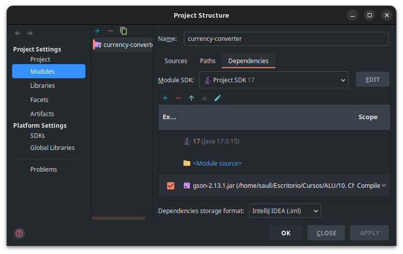
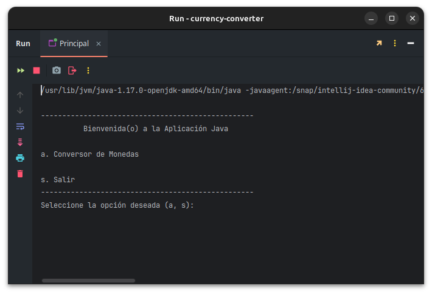
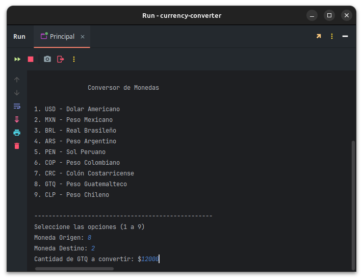
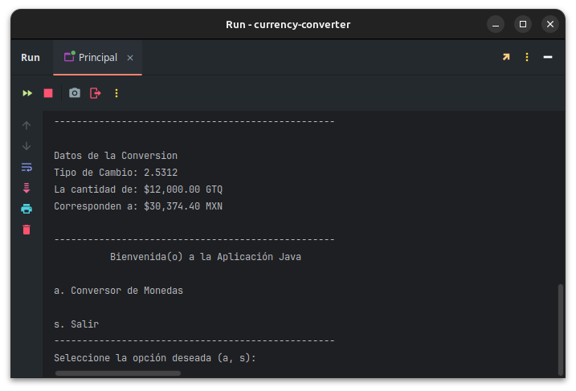

# Challenge Conversor de Monedas

Este Challenge es parte de la formación: **Java Orientado a Objetos** del **Programa ONE** donde aplicaremos los conocimientos adquiridos durante el curso.

## Objetivo
El objetivo principal es aplicar los fundamentos de la ***Programación Orientada a Objetos*** en ***JAVA*** que nos permita desarrollar una aplicación que consuma el servicio de ***ExchangeRate API*** obteniendo el valor de ***tasa de cambio***  para realizar la ***Conversión de Monedas***.

Esta ***versión*** le permitirá al usuario seleccionar las monedas: **Origen** y **Destino** de un listado predeterminado y posteriormente solicitar la **$** cantidad a convertir.

La aplicación dará como resultado los ***Datos de la Conversión*** en pantalla.


## Componentes de la Aplicación

### Estructura
```
com.slve
├── resource                 → imagenes, librerias
└── src
    └── converter
        ├── model            → Clases modelos
        ├── service          → Consumo de servicios API
        ├── util             → Menus
        └── Principal.java   → Ejecutar aplicación
```

### Requerimientos
Los requerimientos para la edición o ejecución de la aplicación son:

- Java Development Kit (**JDK**) versión 17 o superior.
- **IntelliJ IDEA Community** o cualquier otro IDE.
- Librería JAR de la biblioteca [**GSON**](https://mvnrepository.com/artifact/com.google.code.gson/gson) de Google.
- Obtener la **API key** del servicio en [**Exchange Rate**](https://www.exchangerate-api.com/).
- Conexión a Internet.

### Ejecución

1. Clonar el repositorio.
``` bash
git clone https://github.com/saullozada/challenge-conversor-divisas.git
cd challenge-conversor-divisas
```

2. Abrir la carpeta del proyecto en IntelliJ IDEA.

3. Agregar la librería **GSON** que se encuentra en la carpeta ***resource*** en nuestro proyecto de IntelliJ IDEA
   

4. En la clase `Conexion.java ` editara la variable **API_KEY** escribiendo la llave asignada.
``` JAVA
	final String API_KEY = "api_key"; // Definir el valor de la API KEY
```

5. Ejecutar la clase `Principal.java` de la aplicación

6. En el ***Menú Principal***, elegir la opción requerida

   

       `** La siguiente versión se implementara la opción de: b. Histórico de conversiones.`


7. En el ***Menú Secundario*** seleccionar las opciones de las monedas.

    

        `** El menú permite tener conversiones entre diferentes monedas`


8. La aplicación consultara con el ***servicio API*** y obteniendo la tasa de conversión para la conversión.

    
    

9. La aplicación regresara al ***Menú Principal*** después del resultado.

### Licencia
Este proyecto es de uso libre para fines educativos. Puedes adaptarlo y mejorarlo citando su origen.


Desarrollado por: ***Saúl L***
